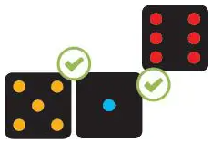
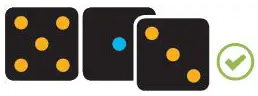
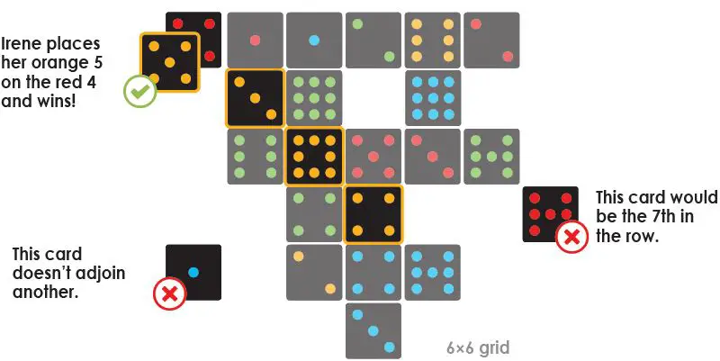
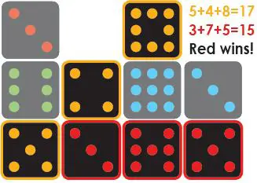

# Punto

## Disclaimer

Punto is a board game designed by Bernhard WEBER and published by Game Factory, Atalia, Popcorn Games, Rebel Sp. z o.o., Reflexshop, and White Goblin Games.

## Rules

Punto is a game where the goal is to align 4 to 5 cards of the same color on a board.

### Content

The game contains 4 decks of 18 cards. Each deck has cards with 1 to 9 dots on it twice, and a color between Blue, Green, Red, and Yellow.

### Distribution

At the beginning of the game, the cards are distributed according to the following rules:

- For 2 players: Each player gets two decks.
- For 3 players: Each player gets one deck. The remaining cards are equally distributed (they wont count as a color).
- For 4 players: Each player gets one deck.

When the cards are distributed, each player must shuffle their deck

### Goal

Now, your goal is to align 4-5 cards of the same color on the board. The number of cards you need to align depends on the number of players:

- For 2 players: Each player must align 5 cards.
- For 3 to 4 players: Each player must align 4 cards.

### Gameplay

When it is your turn, you draw the top card of your deck.

The youngest player starts by placing a card at the center of the board. Then the next player have to play a card.

To play a card, you need to place it near another card (the color of the adjacent card doesn't matter), like on the picture below.


    *fig: Placing a card near to another.*

You can also play by superposing a played card with a smaller value than yours (the color of the card you are playing on doesn't matter either). Like pictured below.


        *fig: The player with Yellow cards superposing a Blue card.*

The playing area has a maximum size of 6x6. The limits of the board depend on where the players place their cards.


*fig: Card placement.*

### Ending Conditions

This game has multiple endings. If a player align 4 or 5 cards of the same color, they win the round. A player must win 2 rounds to win the game.

If a player cannot play a card, if the board is full and the player is unable to superpose a card or if the player doesn't have any card left, the round stops. Each player count how many 3-4 (4 for 2 players, 3 else) cards lines they managed to do. The player with the most lines win.


*fig: Settle a tie.*

If there is a draw between multiple players, the player (in the tie) having 3-4 cards line with the fewest point win the round.

## Application

This game is made using NuxtJS, a framework based on VueJS.

Here are the NodeJS version this application uses:

- Node: v20.10.0
- NPM:  v10.2.3
- Nuxt: v3.10.0

### Features (In Progress)

For now, this game can display a 11x11 board and display random 'cards' when a cell of the board is clicked.

This game will work with MongoDB, using Mongoose. The collections' schemas can be find in the folder :

```
./server/schemas/
```

I'm still developping the game, so features will be added in the future.

### Setup

    Make sure to install the dependencies:

```bash
    # npm
    npm install

    # pnpm
    pnpm install

    # yarn
    yarn install

    # bun
    bun install
```

### Development Server

    Start the development server on`http://localhost:3000`:

```bash
    # npm
    npm run dev

    # pnpm
    pnpm run dev

    # yarn
    yarn dev

    # bun
    bun run dev
```

### Production

    Build the application for production:

```bash
    # npm
    npm run build

    # pnpm
    pnpm run build

    # yarn
    yarn build

    # bun
    bun run build
```

    Locally preview production build:

```bash
    # npm
    npm run preview

    # pnpm
    pnpm run preview

    # yarn
    yarn preview

    # bun
    bun run preview
```
